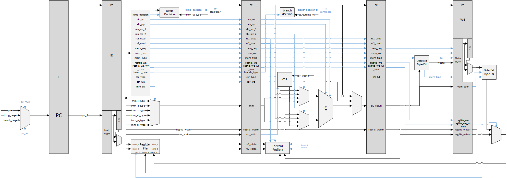
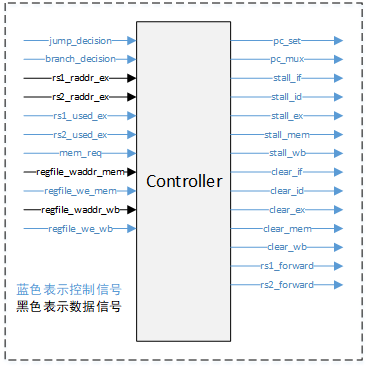

# Lab02实验报告

蒋滨泽	PB18030971

## 实验目标

实现一个支持RISC-V 32I指令集除`fence`, `ecall`, `ebreak`, `fence.i`以外所有指令的流水线CPU。

## 实验环境

Windows 10 2H02

Vivado 2019.2

VSCode

## 实验内容和过程

### 阶段一、二

设计数据通路：由于没有使用实验仓库中给出的源代码，这里重新设计了整个CPU流水，并预先绘制了数据通路图如下（已包含CSR）：

与实验提供的代码有显著区别的地方主要在于

- 在ID段使用Decoder而非Controller生成控制信号，Decoder内完全为组合逻辑。

- Controller主要用来生成控制流水线的stall与flush信号，以及PC的选择控制信号，EX段前驱数据的选择信号。见下：

  

- 对指令字中的标志位以及一些控制信号使用`parameter`进行高度参数化并打包，使用时需要在模块内`import`源代码文件夹中的`include/core_pkg.sv`文件。

- ID段内修改了对寄存器文件同时读写同一个地址数据时的处理。

stall与flush信号的控制：

​	这部分信号在Controller中实现，流水线会在ID段发生jump时清空ID段寄存器，EX段发生branch时清空ID/EX段寄存器（因为IF段寄存器会在下个周期写入正确的地址，所以这里不会清空IF）；除此之外，在MEM段有访存行为，且该访存行为为读取并且写地址与EX段中所用的寄存器号一致且不为0，则stall住IF,ID,EX段寄存器，往MEM段插入气泡。

数据前驱控制信号：

​	当EX段使用的寄存器号与MEM/WB段要写入的寄存器号一致（且不为0），控制rsx_forward信号前驱相应的数据至EX段。

### 阶段三

阶段三的主要任务为添加CSR寄存器文件并支持CSR指令。此处的CSR的寄存器数目可通过`core_pkg.sv`中的参数`CSR_NUM`自定义。

如上述数据通路所示，CSR寄存器文件位于EX段，CSR指令执行到EX段时，将会在EX段的这一个周期内完成对CSR寄存器文件的读和写，写入通用寄存器的数据将在后续段中随着正常指令流的写数据通路传播，从而保证数据前驱时的来源一致性。此外在ID段的Decoder内需要新增对CSR指令的解码以及CSR立即数与地址的选择。CSR指令在EX段读出CSR寄存器数据后根据`csr_type`以及寄存器数据或立即数生成相应的CSR写数据并写入CSR寄存器堆。

## 实验内容和总结

踩的坑有：

​	system verilog对信号的运算分为有符号数和无符号数，需要在代码中使用`$signed()`或`unsigned()`指定运算类型。

​	CSR指令的操作含义（对某几位写，对某几位清零）不是很清楚导致实现时出现了错误。

实验收获：

​	增加了对RISCV指令集的熟悉程度

​	锻炼了system verilog的编写能力

​	锻炼了CPU设计能力

时间分配：

​	4小时画数据通路（主要花在画图上面，设计并不花时间）

​	2天编写整套CPU流水段的框架代码并填充相关信号（大半时间花在信号声明上）

​	4小时debug

​	1天添加CSR并测试

## 改进意见

挺好的，没有意见