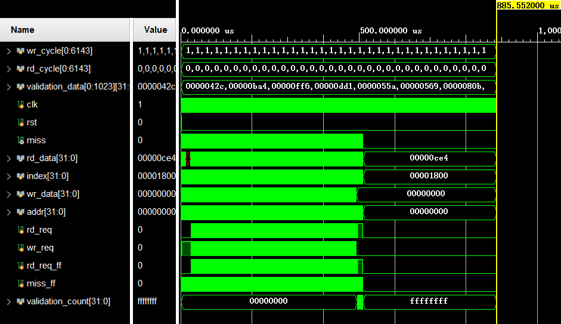
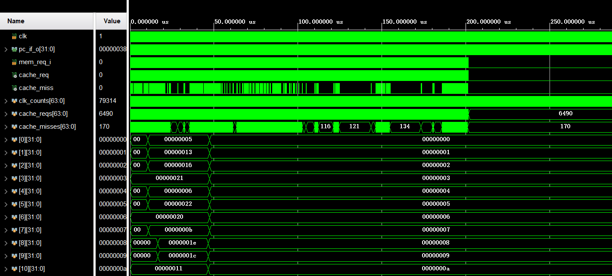
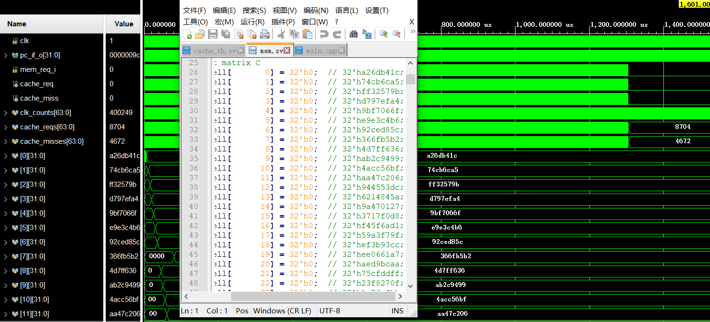

# 计算机体系结构实验三 实验报告

蒋滨泽	PB18030971

## 一、cache编写与结果验证

#### 1.cache编写

cache中维护一个三段式状态机来控制cache的行为，命中时无需操作，缺失时根据是否需要写回进入不同的状态：

```verilog
    // next state logic
    always_comb begin: NEXT_STATE
        case(current_state)
        IDLE: begin
            if(rst) begin
                next_state = IDLE;
            end
            else begin
                //非缺失
                if(!miss) begin
                    next_state = IDLE;
                end
                else begin
                    //缺失，需要写回
                    if(valid[set_addr][replace_num] & dirty[set_addr][replace_num]) begin
                        next_state = SWPO;
                    end
                    else begin
                    //缺失，无需写回
                        next_state = SWPI;
                    end
                end
            end
        end

        SWPO: begin
            if(mem_gnt)
                //写回后，读取数据
                next_state = SWPI;
            else
                // 否则继续等待
                next_state = SWPO; 
        end

        SWPI: begin
            if(mem_gnt) 
                //写入读取数据至cache
                next_state = WRIT;
            else
                //否则等待数据
                next_state = SWPI;
        end

        WRIT: begin
            next_state = IDLE;
        end
        endcase
    end

```

cache通过几个已封装好的信号来进行读写：

```verilog
        always_ff @( posedge clk ) begin: CACHE_WR
            if(rst) begin
                //复位
                for(k = 0;k < SET_SIZE; k++) begin
                    for(l = 0;l < WAY_CNT; l++) begin
                        cache_tags[k][l]    <= '0;
                        valid[k][l]         <= '0;
                    end
                end
            end
            //写命中，写一个字
            if(we_word) begin
                dirty[set_addr][way_hit_num] <=1'b1;
                cache_mem[set_addr][way_hit_num][line_addr] <= wr_data;
            end
            else if(we_line)  begin
                //cache替换，写入新块
                cache_tags[set_addr][replace_num] <= tag_addr;
                valid[set_addr][replace_num] <= 1'b1;
                dirty[set_addr][replace_num] <= 1'b0;
                for(k = 0;k < LINE_SIZE; k++) begin
                    cache_mem[set_addr][replace_num][k] <= mem_rd_line[k];
                end
            end
        end

```

LRU算法和FIFO算法分别通过对每个路进行计数，选择数值最大的作为要替换的块，新块（FIFO）或者被访问的块（LRU）计数值会被置零。

```verilog
`ifdef FIFO
        always_ff @( posedge clk ) begin
            if(!miss) begin
                integer p,q;
                for(p = 0;p < WAY_CNT; p++) begin
                    // just replaced, clear count
                    if(p == replace_num && old_state == WRIT) begin
                        line_age[set_addr][p] <= '0;
                    end
                    else begin
                        line_age[set_addr][p] <= line_age[set_addr][p] + 1;
                    end
                end
            end
        end
`else // LRU
        // Line age
        integer p,q;
            for(p = 0;p < WAY_CNT; p++) begin
                // hit row, clear count
                if((rd_req || wr_req) && (!miss) && p == way_hit_num)
                    line_age[set_addr][p] <= '0;
                else
                    line_age[set_addr][p] <= line_age[set_addr][p] + 1;
            end
        end
`endif
```

#### 2.cache结果验证

（1）1024项针对cache测试的随机读写：



可以看到validation\_count为0xffff\_ffff，结果符合预期。

（2）256项QSORT排序



可以看到主存数据逐渐变有序，符合预期。

（3）16项矩阵乘法测试



可见主存中的数据符合预期。

## 二、cache性能分析 

探究在不同参数下，cache 在不同测试下的综合表现（性能/运行时间，命中率/缺失率）。

### 1.快速排序 256

如果没有特殊说明，cache 一行（LINE）的大小均为 8 个字（LINE\_ADDR\_LEN = 3）。

6444次访存请求。

**（1）固定组数（set_size）为 8 组（ SET\_ADDR\_LEN = 3），改变组相联度。**

- 下表为运行时间（单位：CPU 时钟周期数）：

| 运行时间 | 1路组相联 | 2路组相联 | 4路组相联 | 8路组相联 |
| -------- | --------- | --------- | --------- | --------- |
| FIFO     | 71804     | 52830     | 42177     | 37778     |
| LRU      | 71804     | 51240     | 42283     | 37778     |

- 下表为 cache 缺失率：

| 缺失率 | 1路组相联 | 2路组相联 | 4路组相联 | 8路组相联 |
| ------ | --------- | --------- | --------- | --------- |
| FIFO   | 5.9768%   | 2.9343%   | 1.2046%   | 0.6332%   |
| LRU    | 5.9768%   | 2.7027%   | 1.2201%   | 0.6332%   |

**（2）固定 cache 总大小，调整组相联度和组数**。

- 下表为运行时间（单位：CPU 时钟周期数）：

| 运行时间 | 1路组相联，8组 | 2路组相联，4组 | 4路组相联，2组 |
| -------- | -------------- | -------------- | -------------- |
| FIFO     | 71804          | 61151          | 61045          |
| LRU      | 71804          | 59031          | 58660          |

- 下表为 cache 缺失率：

| 缺失率 | 1路组相联，8组 | 2路组相联，4组 | 4路组相联，2组 |
| ------ | -------------- | -------------- | -------------- |
| FIFO   | 5.9768%        | 4.2625%        | 4.2471%        |
| LRU    | 5.9768%        | 3.9537%        | 3.9073%        |

### 2.矩阵乘法 16

8704次访存请求。

**（1）固定组数（set_size）为 8 组（ SET\_ADDR\_LEN = 3），改变组相联度。**

- 下表为运行时间（单位：CPU 时钟周期数）：

| 运行时间 | 1路组相联 | 2路组相联 | 4路组相联 | 8路组相联 |
| -------- | --------- | --------- | --------- | --------- |
| FIFO     | 349753    | 336185    | 170507    | 73517     |
| LRU      | 349753    | 326009    | 160331    | 72775     |

- 下表为 cache 缺失率：

| 缺失率 | 1路组相联 | 2路组相联 | 4路组相联 | 8路组相联 |
| ------ | --------- | --------- | --------- | --------- |
| FIFO   | 58.8235%  | 55.8823%  | 19.9793%  | 1.6773%   |
| LRU    | 58.8235%  | 53.6765%  | 17.7734%  | 1.4131%   |

**（2）固定 cache 总大小，调整组相联度和组数**。

- 下表为运行时间（单位：CPU 时钟周期数）：

| 运行时间 | 1路组相联，8组 | 2路组相联，4组 | 4路组相联，2组 |
| -------- | -------------- | -------------- | -------------- |
| FIFO     | 349753         | 346361         | 339577         |
| LRU      | 349753         | 326009         | 326009         |

- 下表为 cache 缺失率：

| 缺失率 | 1路组相联，8组 | 2路组相联，4组 | 4路组相联，2组 |
| ------ | -------------- | -------------- | -------------- |
| FIFO   | 58.8235%       | 58.0882%       | 56.6176%       |
| LRU    | 58.8235%       | 53.6764%       | 53.6764%       |

### 3.快速排序 512

13673次访存请求。

**（1）固定组数（set_size）为 8 组（ SET\_ADDR\_LEN = 3），改变组相联度。**

- 下表为运行时间（单位：CPU 时钟周期数）：

| 运行时间 | 1路组相联 | 2路组相联 | 4路组相联 | 8路组相联 |
| -------- | --------- | --------- | --------- | --------- |
| FIFO     | 154076    | 110404    | 100016    | 81307     |
| LRU      | 154076    | 109397    | 98585     | 88939     |

- 下表为 cache 缺失率：

| 缺失率 | 1路组相联 | 2路组相联 | 4路组相联 | 8路组相联 |
| ------ | --------- | --------- | --------- | --------- |
| FIFO   | 6.0273%   | 2.7937%   | 2.0604%   | 0.7259%   |
| LRU    | 6.0273%   | 2.7277%   | 1.9578%   | 1.2538%   |

**（2）固定 cache 总大小，调整组相联度和组数**。

- 下表为运行时间（单位：CPU 时钟周期数）：

| 运行时间 | 1路组相联，8组 | 2路组相联，4组 | 4路组相联，2组 |
| -------- | -------------- | -------------- | -------------- |
| FIFO     | 154076         | 126251         | 125880         |
| LRU      | 154076         | 123813         | 123071         |

- 下表为 cache 缺失率：

| 缺失率 | 1路组相联，8组 | 2路组相联，4组 | 4路组相联，2组 |
| ------ | -------------- | -------------- | -------------- |
| FIFO   | 6.0273%        | 3.9375%        | 3.9082%        |
| LRU    | 6.0273%        | 3.7762%        | 3.7249%        |

### 4.矩阵乘法 8

1152次访存请求。

**（1）固定组数（set_size）为 8 组（ SET\_ADDR\_LEN = 3），改变组相联度。**

- 下表为运行时间（单位：CPU 时钟周期数）：

| 运行时间 | 1路组相联 | 2路组相联 | 4路组相联 | 8路组相联 |
| -------- | --------- | --------- | --------- | --------- |
| FIFO     | 26141     | 21212     | 9817      | 9817      |
| LRU      | 26141     | 19463     | 9817      | 9817      |

- 下表为 cache 缺失率：

| 缺失率 | 1路组相联 | 2路组相联 | 4路组相联 | 8路组相联 |
| ------ | --------- | --------- | --------- | --------- |
| FIFO   | 23.3507%  | 16.2326%  | 2.0833%   | 2.0833%   |
| LRU    | 23.3507%  | 13.0208%  | 2.0833%   | 2.0833%   |

**（2）固定 cache 总大小，调整组相联度和组数**。

- 下表为运行时间（单位：CPU 时钟周期数）：

| 运行时间 | 1路组相联，8组 | 2路组相联，4组 | 4路组相联，2组 |
| -------- | -------------- | -------------- | -------------- |
| FIFO     | 26141          | 28155          | 34727          |
| LRU      | 26141          | 24657          | 31335          |

- 下表为 cache 缺失率：

| 缺失率 | 1路组相联，8组 | 2路组相联，4组 | 4路组相联，2组 |
| ------ | -------------- | -------------- | -------------- |
| FIFO   | 23.3507%       | 26.6493%       | 37.4132%       |
| LRU    | 23.3507%       | 20.9201%       | 31.8576%       |

对cache性能的分析分为以下几个方面：

- **不同的替换策略：**绝大部分情况下，LRU替换策略要较优于FIFO替换策略，缺失率越高，LRU相对FIFO所降低缺失率的比重就越大。
- **相同组数下，不同组相联度：**增大组相联度，cache大小增大，随着组相联度的增加，cache的缺失率急剧下降，显著降低程序的运行时间，对性能提升的表现很好。但由于冷启动导致的不可避免的miss不会因为cache增大而减小，所以无法完全避免cache miss的情况。
- **相同cache大小下，不同的组相联度：**增大组相联度，因为同时减小了组数，所以在大部分情况下只能略微地减小cache的缺失率。甚至在某些情况下缺失率还会变大。值得注意的是相同大小cache的情况下，LRU替换策略的对缺失率的减小效果要明显好于FIFO，特别是组数较多时。
- **不同的测试程序：**矩阵乘法的运行所导致的缺失率要明显高于快速排序运行所导致的缺失率，这可能是由于矩阵运算的特性所导致的。

## 三、cache资源占用

**（1）固定组数（set_size）为 8 组（ SET\_ADDR\_LEN = 3），改变组相联度。**

| 电路资源（百分比） | 1路组相联，8组         | 2路组相联，8组         | 4路组相联，8组         |
| ------------------ | ---------------------- | ---------------------- | ---------------------- |
| FIFO               | LUT：1.75% / FF：2.19% | LUT：4.05% / FF：4.26% | LUT：8.89% / FF：7.99% |
| LRU                | LUT：1.75% / FF：2.19% | LUT：4.22% / FF：4.26% | LUT：9.47% / FF：8.00% |

**（2）固定 cache 总大小，调整组相联度和组数**。

| 电路资源（百分比） | 1路组相联，8组         | 2路组相联，4组         | 4路组相联，2组         |
| ------------------ | ---------------------- | ---------------------- | ---------------------- |
| FIFO               | LUT：1.75% / FF：2.19% | LUT：3.44% / FF：2.40% | LUT：4.23% / FF：2.40% |
| LRU                | LUT：1.75% / FF：2.19% | LUT：3.47% / FF：2.40% | LUT：4.54% / FF：2.41% |

两种实现方式在电路资源的消耗方面相差不是很大，可能原因是在实现算法时对FIFO算法和LRU算法都通过计数的方法来寻找要替换的块，实现差异不大，导致资源消耗相近。不过还是能看出LRU对硬件资源的需求量要大于FIFO所消耗的电路资源。

而在通过提升组数来增加cache大小时，可以发现随着组数和cache大小的增加，电路资源的消耗随着cache大小的增大呈现（略高于）近似的线性关系，表明cache大小对资源的消耗是主力。

但是在固定cache大小时，可以发现组相联度的提升没有明显增加FF的资源消耗，却明显增加了对LUT资源的消耗，表明组相联度的提升对布线要求的更高，但是因为cache大小没有变化，所以对触发器的需求没有显著增大。

## 四、实验总结

LRU替换策略要明显优于FIFO，在条件允许的情况下，应当使用LRU算法；考虑到实现LRU算法在硬件上高昂的资源需求，可以用近似LRU算法进行替代（如记录下次要替换的块时，每次命中到记录所指的块，就指向下一块）。

增大cache在一定程度上能有效减少缺失率，但是随着cache增大，对降低缺失率做出的贡献也越小，应当合适地选择cache的大小与组相联度（如2路或4路组相联），既不要过小也不要过大。

cache大小受限时，可以通过权衡组相联度与组数，通过具体的测试结果选择较好的方案。

在本次实验，综合表现4路组相联，8组，LRU的cache效果最好，建议使用。
