# 计算机体系结构实验五 实验报告

蒋滨泽	PB18030971

## 一、Tomasulo算法模拟

### 1.分别截图（当前周期2和当前周期3），请简要说明load部件做了什么改动

周期 2：

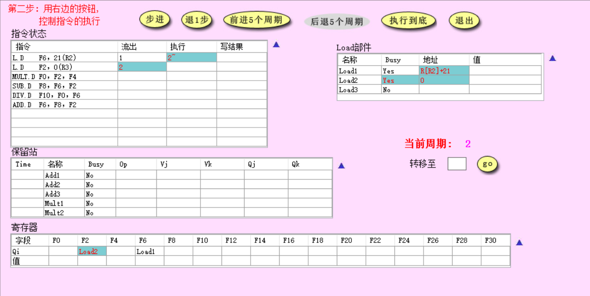

第二个周期时，第一条Load指令开始执行，第二条Load指令发射，分别使用两个不同的Load部件。

第一条Load指令获得读取地址M[R2]+21开始执行。

第二条Load指令占用Load部件，将对应的Load功能部件标为Busy，并更新写入占用的寄存器。

周期 3：

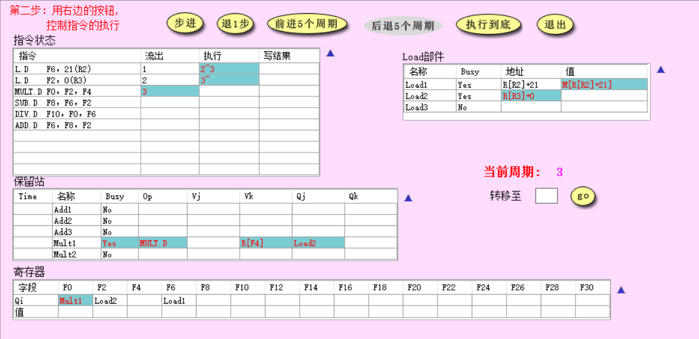

第三个周期时，第一条Load指令返回结果，第二条Load指令获得读取地址M[R3]开始执行。

### 2.请截图（MUL.D刚开始执行时系统状态），并说明该周期相比上一周期整个系统发生了哪些改动（指令状态、保留站、寄存器和Load部件）

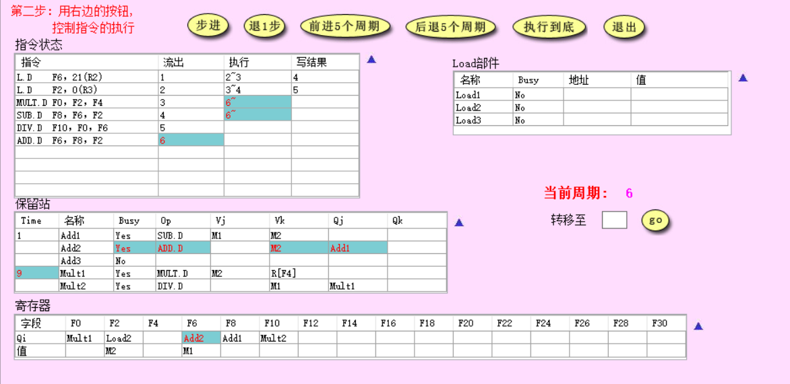

MULT.D在第6个周期开始执行。

相比上个周期的改动：

- SUB.D指令也开始执行
- ADD.D指令发射
- ADD.D指令占用保留站Add2，Add2变为Busy，并有Op=ADD.D，Vk=M2，Qj=Add1
- Mult1等待时间更新为9
- 指令L.D F2 0(R3)写完成
- 寄存器字段F6的Qi从Load1变为Add2

### 3.简要说明是什么相关导致MUL.D流出后没有立即执行

关于寄存器F2的写后读（RAW）相关

### 4.请分别截图（15周期和16周期的系统状态），并分析系统发生了哪些变化

第15周期：

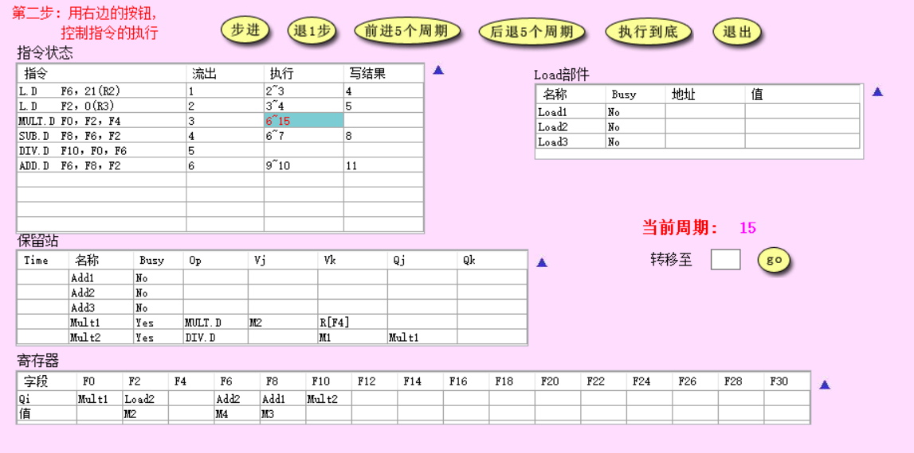

第15周期，MULT.D指令执行结束。

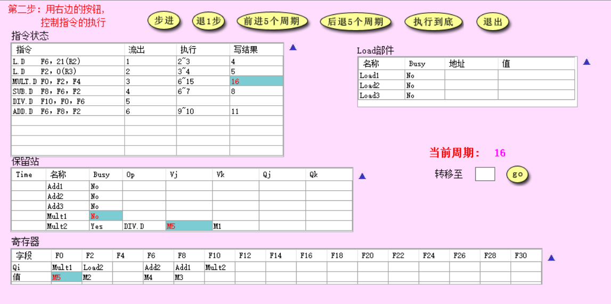

第16周期，MULT.D1写结果，释放保留站资源，MULT2获得操作数M5，寄存器F0被写入M5.

### 5.回答所有指令刚刚执行完毕时是第多少周期，同时请截图（最后一条指令写CBD时认为指令流执行结束）

L.D F6, 21(R2)在第4周期执行结束

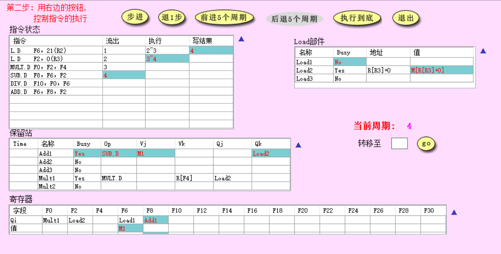

L.D F2,0(R3)在第5周期执行结束

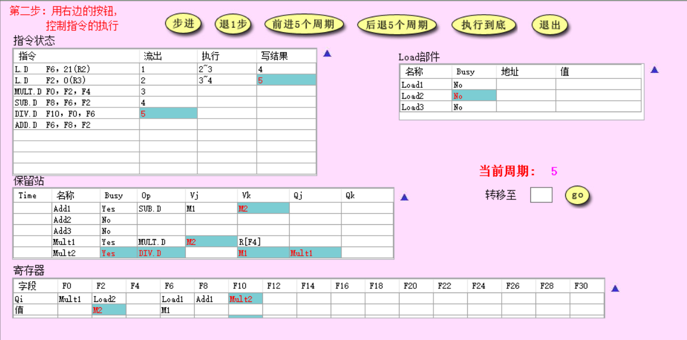

MULT.D F0,F2,F4在第16周期执行结束

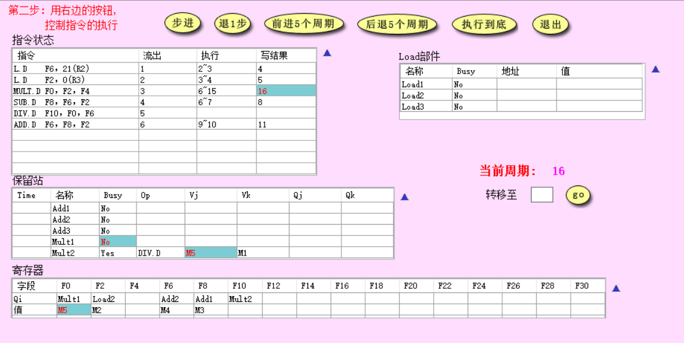

SUB.D F8,F6,F2在第8个周期执行结束

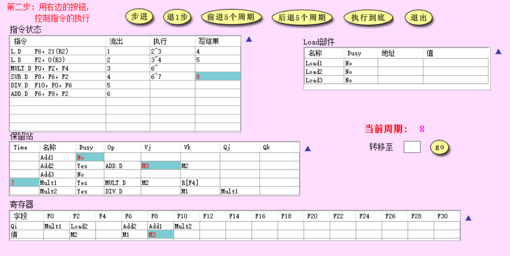

DIV.D F10,F0,F6在第57个周期执行结束

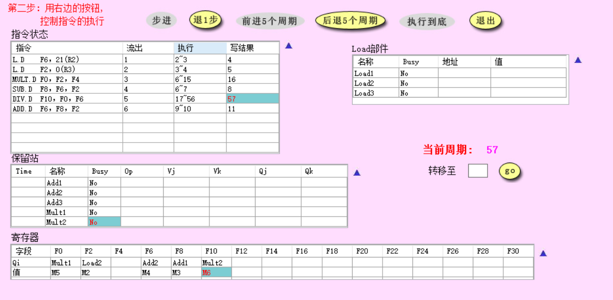

ADD.D F6,F8,F2在第11个周期执行结束

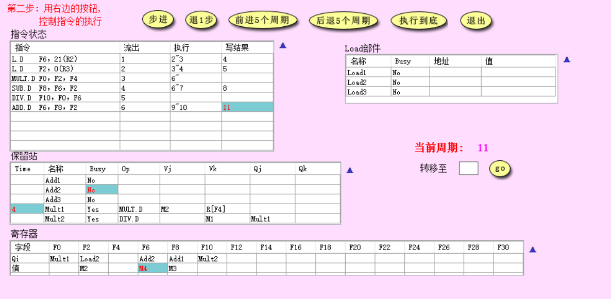

## 二、Cache一致性-监听法

| 所进行的访问   | 是否发生了替换？ | 是否发生了写回？ | 监听协议进行的操作与块状态改变                               |
| -------------- | ---------------- | ---------------- | ------------------------------------------------------------ |
| CPU A 读第5块  | x                | x                | 第五块从主存进入A缓存，状态为共享                            |
| CPU B 读第5块  | x                | x                | 第五块从主存进入B缓存，状态为共享                            |
| CPU C 读第5块  | x                | x                | 第五块从主存进入C缓存，状态为共享                            |
| CPU B 写第5块  | x                | x                | 写命中，总线广播作废信号，AC中的第五块作废，B的第五块变为独占 |
| CPU D 读第5块  | x                | √                | B将第五块写回，B中第五块变为共享；第五块从主存进入D缓存，状态为共享。 |
| CPU B 写第21块 | √                | x                | 第21块从主存进入B缓存取代第五块位置，状态为独占              |
| CPU A 写第23块 | x                | x                | 第23块从主存进入A缓存，状态为独占                            |
| CPU C 写第23块 | x                | √                | A将第23块写回主存，第23块从主存进入C缓存，状态为独占         |
| CPU B 读第29块 | √                | √                | B将第21块写回，第29块从主存进入B缓存，状态为共享             |
| CPU B 写第5块  | √                | x                | 第5块从主存进入B缓存替换29块的位置，状态为独占；D中第五块标志位无效 |

截图：

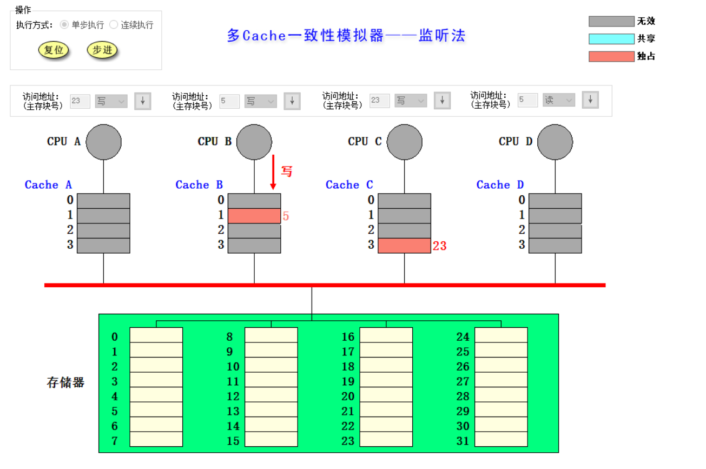

## 三、Cache一致性-目录法

| 所进行的访问   | 监听协议进行的操作与块状态改变                               |
| -------------- | ------------------------------------------------------------ |
| CPU A 读第6块  | A读不命中向宿主发送读取请求，宿主返回数据并将共享集合设为A，状态共享 |
| CPU B 读第6块  | B读不命中向宿主节点发送读取请求，宿主通过互联网络返回数据并将共享集合设为A+B，状态为共享 |
| CPU D 读第6块  | D读不命中向宿主节点发送读取请求，宿主通过互联网络返回数据并将共享集合设为ABD，状态为共享 |
| CPU B 写第6块  | B写命中，并告诉宿主写命中，宿主设置共享集合为B，状态为独占，并通过互联网络广播6块作废消息，A与D中的块作废 |
| CPU C 读第6块  | C读不命中，向宿主节点发送读取请求，宿主广播取数据块6的请求，B得知请求返回最新的数据块6，宿主更新共享集合为BC，状态位共享，并将数据块6发送给C |
| CPU D 写第20块 | D写不命中，向宿主发送取数据请求，宿主通过互联网络返回数据，并将共享集合设为D，状态位独占。D写入块20 |
| CPU A 写第20块 | A写不命中，向宿主发送取数据请求，宿主通过互联网络广播取并作费第20块，D返回第20块并作废本地cache数据，宿主返回第20块数据给A，并更新共享集合为A，状态为独占。A写入块20 |
| CPU D 写第6块  | D写不命中，向宿主发送取数据请求，宿主通过互联网络广播作废第6块，BC作废第六块，发送第6块给D，并更新共享集合为D，状态为独占，D写入块6 |
| CPU A 读第12块 | A发现第12块的位置为第20块的缓存，发送第20块写回并修改给宿主，宿主收到后更新共享集合为空集。然后A向宿主发送第12块取数据请求，宿主返回数据并更新共享集合为A，状态为共享。 |

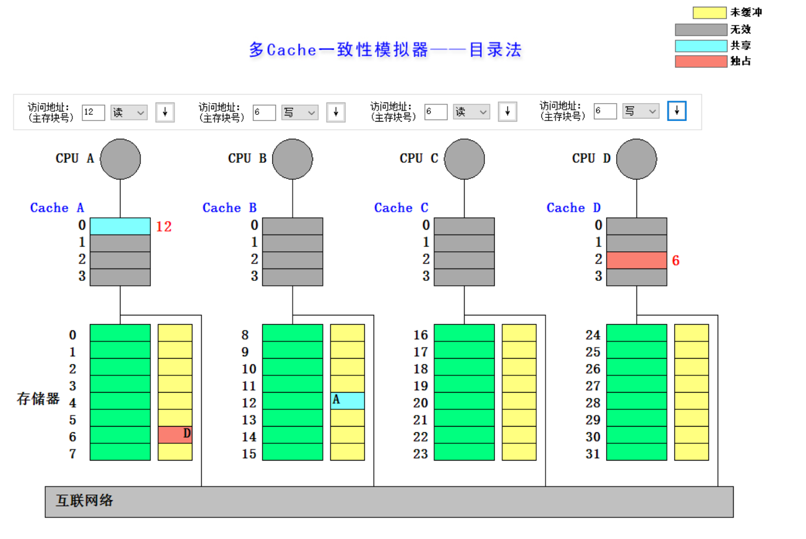

## 四、综合回答

### 1.目录法和监听法分别是集中式和基于总线，两者优劣是什么？（言之有理即可）

答：监听法好处在于在小型体系中，总线之间的交流少，宿主间沟通时间短，成本低效果好。缺点是当CPU数量变多时，总线压力大，性能下降快；

目录法好处在于支持大型体系，总线压力小；缺点在于随着核数增多目录开销比较大，宿主与缓存沟通次数多，对于多写的操作序列不友好。

### 2.Tomasulo算法相比Score Board算法有什么异同？（简要回答两点：1.分别解决了什么相关，2.分别是分布式还是集中式）（参考第五版教材）

答：

相同点：两种算法都解决了三种相关，都通过动态调度的方法解决RAW相关。

不同点：Tomasulo通过发射阶段寄存器重命名解决WAW和WAR相关，记分板则通过stall方式解决。Tomasulo可以直接将结果写入保留站，记分板需要先写入寄存器，再从寄存器中读取数据。Tomasulo是分布式，记分板为集中式。

### 3.Tomasulo算法是如何解决结构、RAW、WAR和WAW相关的？（参考第五版教材）

结构相关：计算资源可用时才发射指令。

RAW：从寄存器站获取数据，如果数据未准备好则获取产生结果站点的名称，在CDB上等待数据准备好后再执行。

WAW与WAR：寄存器重命名。